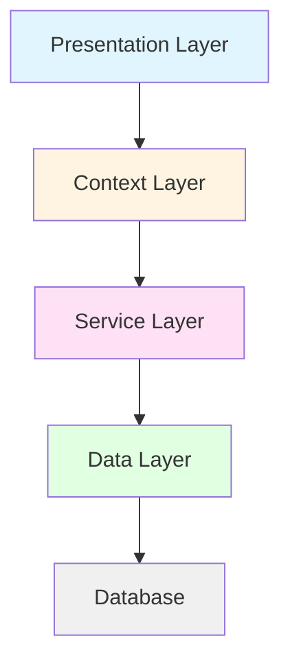
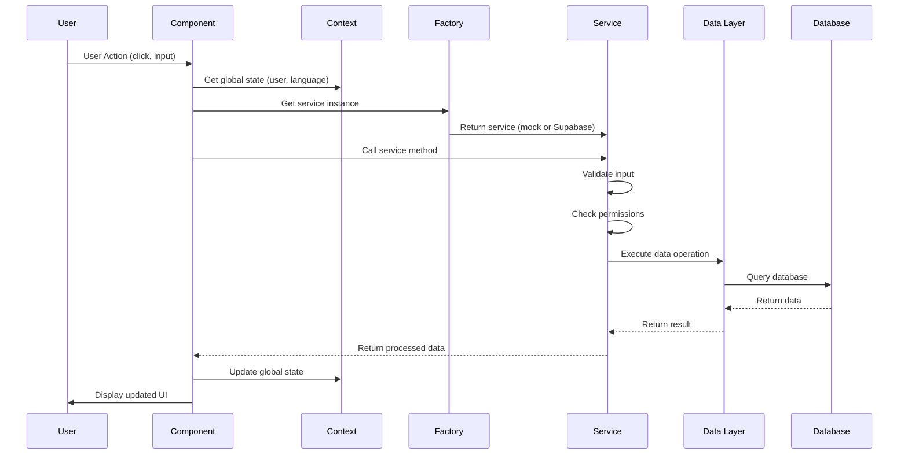
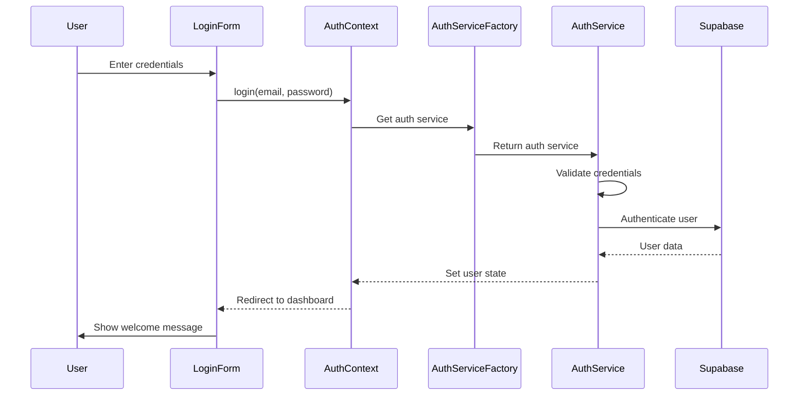
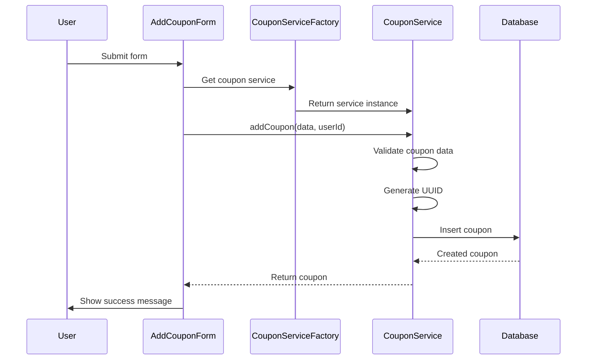
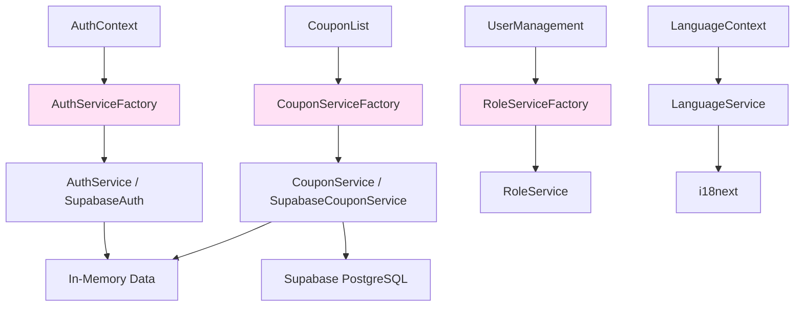
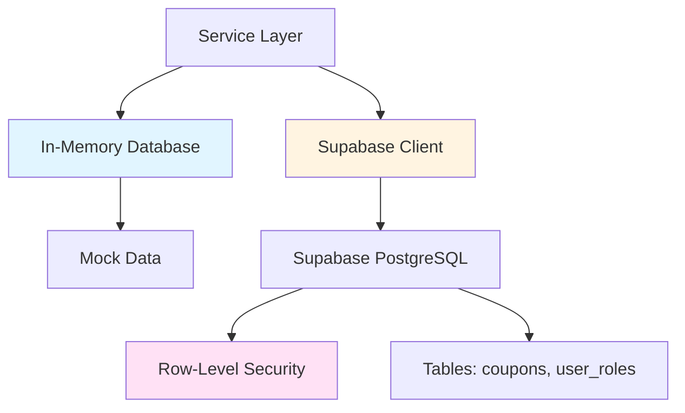
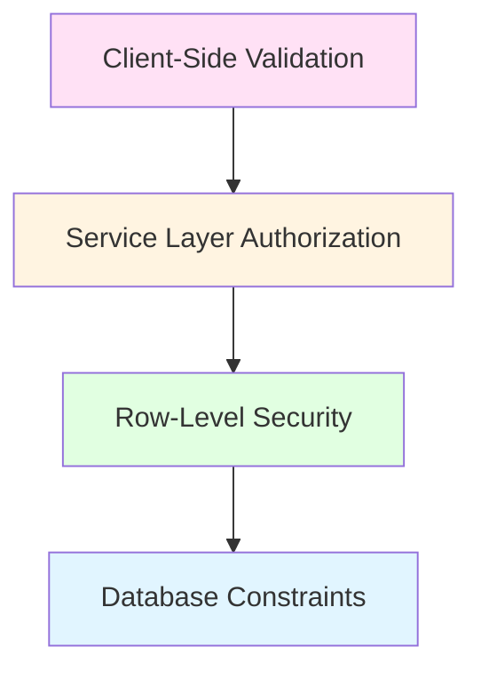
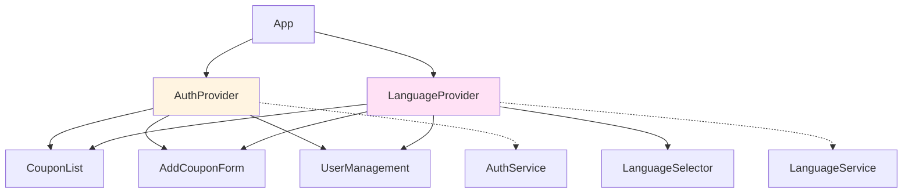
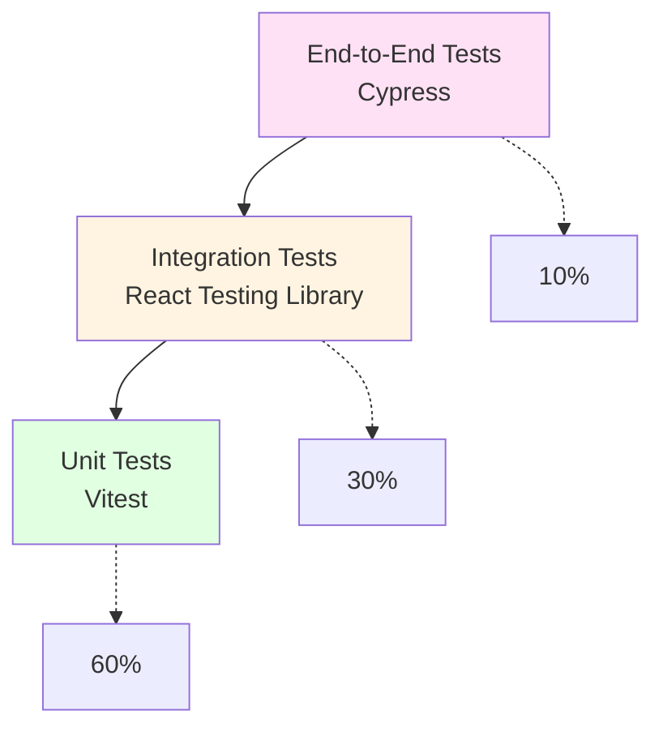
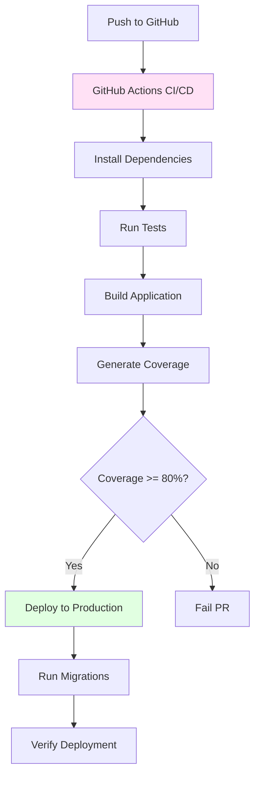

# System Architecture

**Version:** 1.0.0
**Purpose:** Comprehensive system architecture documentation for CouponManager
**Last Updated:** 2025-01-27

---

## Table of Contents

1. [Overview](#overview)
2. [Architecture Layers](#architecture-layers)
3. [Design Patterns](#design-patterns)
4. [Data Flow](#data-flow)
5. [Component Architecture](#component-architecture)
6. [Service Layer Architecture](#service-layer-architecture)
7. [Data Layer Architecture](#data-layer-architecture)
8. [Security Architecture](#security-architecture)
9. [State Management](#state-management)
10. [Internationalization Architecture](#internationalization-architecture)
11. [Testing Architecture](#testing-architecture)
12. [Deployment Architecture](#deployment-architecture)

---

## Overview

CouponManager follows a layered architecture with clear separation of concerns, enabling maintainability, testability, and scalability.

### Architecture Principles

- **Separation of Concerns:** Each layer has a distinct responsibility
- **Dependency Inversion:** High-level modules don't depend on low-level modules
- **Single Responsibility:** Each component/class has one reason to change
- **Open/Closed:** Open for extension, closed for modification
- **Factory Pattern:** Service instantiation abstracted through factories

### Technology Decisions

| Decision | Technology | Rationale |
|----------|------------|-----------|
| Frontend Framework | React 18.2.0 | Component-based, large ecosystem, excellent TypeScript support |
| Language | TypeScript 5.x | Type safety, better IDE support, catch errors at compile time |
| UI Library | Material-UI 5.15.0 | Consistent design, accessible components, theming support |
| Build Tool | Vite 5.0.0 | Fast development server, optimized production builds |
| Backend | Supabase 2.49.1 | Serverless, built-in auth, PostgreSQL, RLS |
| State Management | React Context API | Native, no external dependencies, sufficient for current complexity |
| i18n | i18next 24.2.2 | Industry standard, namespace support, type-safe keys |
| Testing | Vitest + React Testing Library | Fast, modern, encourages testing user behavior |
| Package Manager | pnpm | Efficient disk space usage, strict dependencies |

---

## Architecture Layers

### Layer Diagram



### Layer Responsibilities

#### 1. Presentation Layer
- **Components:** React functional components with hooks
- **Responsibility:** Render UI, handle user interactions, display data
- **Files:** `src/components/*.tsx`
- **No:** Business logic, data access, service instantiation

#### 2. Context Layer
- **Context Providers:** AuthContext, LanguageContext
- **Responsibility:** Global state management, dependency injection
- **Files:** `src/services/*Context.tsx`
- **No:** UI rendering, direct database access

#### 3. Service Layer
- **Services:** AuthService, CouponService, RoleService, LanguageService
- **Responsibility:** Business logic, data transformation, permission checks
- **Files:** `src/services/*.ts`
- **No:** UI rendering, direct database manipulation (via client)

#### 4. Data Layer
- **Data Sources:** In-memory database, Supabase PostgreSQL
- **Responsibility:** Data persistence, query execution
- **Files:** Mock services, Supabase client, migration scripts
- **No:** Business logic, permission enforcement

---

## Design Patterns

### Factory Pattern

**Purpose:** Abstract service instantiation and enable environment-based switching

**Implementation:**
```typescript
// CouponServiceFactory.ts
import CouponService from './CouponService';
import SupabaseCouponService from './SupabaseCouponService';

let couponServiceInstance: CouponService | SupabaseCouponService | null = null;

export const getCouponService = (): CouponService | SupabaseCouponService => {
  if (couponServiceInstance) {
    return couponServiceInstance;
  }

  const useMemoryDB = import.meta.env.VITE_USE_MEMORY_DB === 'true';

  if (useMemoryDB) {
    couponServiceInstance = CouponService;
  } else {
    couponServiceInstance = SupabaseCouponService;
  }

  return couponServiceInstance;
};
```

**Benefits:**
- Single source of truth for service instances
- Easy switching between development/production environments
- Lazy initialization for performance
- Testability (easy to mock factories)

**Usage:**
```typescript
// ✅ Correct
import { getCouponService } from './services/CouponServiceFactory';
const service = getCouponService();

// ❌ Incorrect
import CouponService from './services/CouponService';
const service = new CouponService();
```

### Singleton Pattern

**Purpose:** Ensure single instance of context providers

**Implementation:**
```typescript
// AuthContext.tsx
const AuthContext = createContext<AuthContextType | undefined>(undefined);

export const AuthProvider: React.FC<{ children: React.ReactNode }> = ({ children }) => {
  // Single state instance
  const [user, setUser] = useState<User | null>(null);

  return (
    <AuthContext.Provider value={{ user, login, logout, signUp }}>
      {children}
    </AuthContext.Provider>
  );
};
```

### Repository Pattern

**Purpose:** Abstract data access logic

**Implementation:**
```typescript
// CouponService.ts (In-memory repository)
class CouponService {
  private coupons: Map<string, Coupon> = new Map();

  async getAllCoupons(userId?: string): Promise<Coupon[]> {
    if (userId) {
      return Array.from(this.coupons.values()).filter(c => c.userId === userId);
    }
    return Array.from(this.coupons.values());
  }

  async addCoupon(couponData: CouponFormData, userId?: string): Promise<Coupon> {
    const coupon: Coupon = {
      id: uuidv4(),
      ...couponData,
      userId: userId || 'default-user',
      created_at: new Date().toISOString()
    };
    this.coupons.set(coupon.id, coupon);
    return coupon;
  }
}

export default new CouponService();
```

### Adapter Pattern

**Purpose:** Adapt mock services to production interfaces

**Implementation:**
```typescript
// Mock data adapter
const mockCoupons = [
  {
    id: '1',
    userId: 'user-1',
    retailer: 'Amazon',
    initialValue: '50',
    currentValue: '50',
    created_at: '2024-01-01T00:00:00Z'
  }
  // ... more mock data
];

// Inject mock data into in-memory service
const injectMockData = () => {
  mockCoupons.forEach(coupon => {
    CouponService.addCoupon(coupon, coupon.userId);
  });
};
```

---

## Data Flow

### Typical Request Flow



### Authentication Flow



### Coupon Creation Flow



---

## Component Architecture

### Component Hierarchy

```
App.tsx
├── AuthProvider (AuthContext)
│   ├── LoginForm
│   │   └── Material-UI Components (TextField, Button, etc.)
│   ├── UserManagement (manager only)
│   │   └── Material-UI Components
│   └── LanguageProvider (LanguageContext)
│       ├── LanguageSelector
│       │   └── Select Component
│       └── Main Content
│           ├── CouponList
│           │   ├── Card Components
│           │   ├── Dialog Components
│           │   └── Filter Components
│           ├── AddCouponForm
│           │   └── Form Components
│           ├── BarcodeScanner
│           │   └── react-qr-reader
│           └── RetailerList
│               └── Card Components
```

### Component Design Principles

#### 1. Single Responsibility
- Each component renders one UI concern
- Complex UIs are split into smaller components
- Reusable components are extracted

#### 2. Composition over Inheritance
- Components compose other components
- No component inheritance hierarchy
- Use props for customization

#### 3. Controlled Components
- All form inputs are controlled
- State is managed by React
- Validation occurs in handlers

#### 4. Container/Presenter Pattern (if applicable)
- **Container Components:** Fetch data, handle logic
- **Presenter Components:** Pure UI, receive props
- Currently, most components are self-contained

### Component State Management

#### Local State
```typescript
const [state, setState] = useState<Type>(initialValue);
```
- Component-specific state
- Not shared with other components
- Simple, synchronous updates

#### Context State
```typescript
const { user, login, logout } = useAuth();
const { language, changeLanguage, t } = useLanguage();
```
- Global state shared across components
- Authentication and language state
- Accessed via custom hooks

#### Derived State
```typescript
const filteredCoupons = coupons.filter(c => c.retailer === filter);
```
- Computed from other state
- No need for useState
- Recalculated on every render

---

## Service Layer Architecture

### Service Architecture Diagram



### Service Responsibilities

#### AuthService
- User authentication (login, logout, signUp)
- Session management
- User data retrieval
- Password handling (hashed in production)

#### CouponService
- CRUD operations for coupons
- Data validation
- Ownership verification
- Filtering and sorting

#### RoleService
- Role checking (user, manager, demo)
- Permission verification
- Access control enforcement
- User role management (managers only)

#### LanguageService
- i18n configuration
- Translation retrieval
- Language switching
- Namespace management

### Service Implementation Pattern

#### Base Service Interface
```typescript
interface ICouponService {
  getAllCoupons(userId?: string): Promise<Coupon[]>;
  getCoupon(id: string, userId?: string): Promise<Coupon | null>;
  addCoupon(data: CouponFormData, userId?: string): Promise<Coupon>;
  updateCoupon(id: string, data: Partial<CouponFormData>, userId?: string): Promise<Coupon>;
  deleteCoupon(id: string, userId?: string): Promise<boolean>;
}
```

#### In-Memory Implementation
```typescript
class CouponService implements ICouponService {
  private coupons: Map<string, Coupon> = new Map();

  async getAllCoupons(userId?: string): Promise<Coupon[]> {
    const allCoupons = Array.from(this.coupons.values());
    if (userId) {
      return allCoupons.filter(c => c.userId === userId);
    }
    return allCoupons;
  }

  async getCoupon(id: string, userId?: string): Promise<Coupon | null> {
    const coupon = this.coupons.get(id);
    if (!coupon) return null;

    if (userId && coupon.userId !== userId) {
      throw new Error('Access denied: You can only access your own coupons');
    }

    return coupon;
  }

  async addCoupon(data: CouponFormData, userId?: string): Promise<Coupon> {
    if (!data.retailer || !data.initialValue) {
      throw new Error('Retailer and initial value are required');
    }

    const coupon: Coupon = {
      id: uuidv4(),
      ...data,
      userId: userId || 'default-user',
      created_at: new Date().toISOString(),
      updated_at: new Date().toISOString()
    };

    this.coupons.set(coupon.id, coupon);
    return coupon;
  }

  // ... other methods
}

export default new CouponService();
```

#### Supabase Implementation
```typescript
class SupabaseCouponService implements ICouponService {
  private supabase = getSupabaseClient();

  async getAllCoupons(userId?: string): Promise<Coupon[]> {
    let query = this.supabase
      .from('coupons')
      .select('*')
      .order('created_at', { ascending: false });

    if (userId) {
      query = query.eq('user_id', userId);
    }

    const { data, error } = await query;

    if (error) throw new Error(`Failed to fetch coupons: ${error.message}`);
    return data || [];
  }

  async getCoupon(id: string, userId?: string): Promise<Coupon | null> {
    const { data, error } = await this.supabase
      .from('coupons')
      .select('*')
      .eq('id', id)
      .single();

    if (error) {
      if (error.code === 'PGRST116') return null;
      throw new Error(`Failed to fetch coupon: ${error.message}`);
    }

    if (userId && data.user_id !== userId) {
      throw new Error('Access denied: You can only access your own coupons');
    }

    return data;
  }

  // ... other methods
}

export default new SupabaseCouponService();
```

---

## Data Layer Architecture

### Data Layer Diagram



### In-Memory Database

**Purpose:** Fast development, isolated testing, no external dependencies

**Implementation:**
```typescript
// JavaScript Map-based storage
class InMemoryDB {
  private data: Map<string, any> = new Map();

  insert(table: string, data: any): any {
    const id = data.id || uuidv4();
    const record = { ...data, id, created_at: new Date().toISOString() };
    this.data.set(`${table}:${id}`, record);
    return record;
  }

  update(table: string, id: string, data: any): any | null {
    const key = `${table}:${id}`;
    const existing = this.data.get(key);
    if (!existing) return null;

    const updated = { ...existing, ...data, updated_at: new Date().toISOString() };
    this.data.set(key, updated);
    return updated;
  }

  delete(table: string, id: string): boolean {
    return this.data.delete(`${table}:${id}`);
  }

  query(table: string): any[] {
    return Array.from(this.data.entries())
      .filter(([key]) => key.startsWith(`${table}:`))
      .map(([, value]) => value);
  }
}
```

### Supabase PostgreSQL

**Purpose:** Production data persistence, real-time updates, server-side security

**Features:**
- PostgreSQL database (via Supabase)
- Row-Level Security (RLS)
- Built-in authentication
- Real-time subscriptions (not currently used)
- Backup and replication (managed by Supabase)

**Tables:**
```sql
-- coupons table
CREATE TABLE coupons (
  id UUID PRIMARY KEY DEFAULT gen_random_uuid(),
  user_id UUID NOT NULL REFERENCES auth.users(id),
  retailer TEXT NOT NULL,
  initial_value TEXT NOT NULL,
  current_value TEXT,
  expiration_date DATE,
  notes TEXT,
  barcode TEXT,
  reference TEXT,
  activation_code TEXT,
  pin TEXT,
  created_at TIMESTAMP WITH TIME ZONE DEFAULT NOW(),
  updated_at TIMESTAMP WITH TIME ZONE DEFAULT NOW()
);

-- user_roles table
CREATE TABLE user_roles (
  user_id UUID PRIMARY KEY REFERENCES auth.users(id),
  role TEXT NOT NULL CHECK (role IN ('user', 'manager', 'demo')),
  created_at TIMESTAMP WITH TIME ZONE DEFAULT NOW()
);
```

### Row-Level Security (RLS)

**Purpose:** Server-side access control based on user identity

**Policies:**
```sql
-- Enable RLS
ALTER TABLE coupons ENABLE ROW LEVEL SECURITY;

-- Policy: Users can see only their own coupons
CREATE POLICY "Users can see own coupons"
  ON coupons FOR SELECT
  USING (auth.uid() = user_id);

-- Policy: Users can insert only their own coupons
CREATE POLICY "Users can insert own coupons"
  ON coupons FOR INSERT
  WITH CHECK (auth.uid() = user_id);

-- Policy: Users can update only their own coupons
CREATE POLICY "Users can update own coupons"
  ON coupons FOR UPDATE
  USING (auth.uid() = user_id);

-- Policy: Users can delete only their own coupons
CREATE POLICY "Users can delete own coupons"
  ON coupons FOR DELETE
  USING (auth.uid() = user_id);

-- Policy: Managers can see all coupons
CREATE POLICY "Managers can see all coupons"
  ON coupons FOR SELECT
  USING (
    EXISTS (
      SELECT 1 FROM user_roles
      WHERE user_id = auth.uid() AND role = 'manager'
    )
  );
```

---

## Security Architecture

### Security Layers



### 1. Client-Side Validation

**Purpose:** User experience, immediate feedback

**Implementation:**
```typescript
const validateCouponForm = (data: CouponFormData): string[] => {
  const errors = [];

  if (!data.retailer?.trim()) {
    errors.push('Retailer is required');
  }

  if (!data.initialValue?.trim()) {
    errors.push('Initial value is required');
  }

  if (data.initialValue && isNaN(parseFloat(data.initialValue))) {
    errors.push('Initial value must be a number');
  }

  return errors;
};
```

### 2. Service Layer Authorization

**Purpose:** Business logic enforcement, permission checks

**Implementation:**
```typescript
class RoleService {
  hasPermission(user: User | null, action: string, resource: string): boolean {
    if (!user) return false;

    switch (user.role) {
      case 'manager':
        return true; // Managers have all permissions

      case 'user':
        // Users can access their own resources
        if (action === 'read' || action === 'create') {
          return true;
        }
        if (action === 'update' || action === 'delete') {
          return resource.userId === user.id;
        }
        return false;

      case 'demo':
        // Demo users have read-only access
        return action === 'read';

      default:
        return false;
    }
  }

  canManageCoupons(user: User | null): boolean {
    return user?.role === 'user' || user?.role === 'manager';
  }

  canManageUsers(user: User | null): boolean {
    return user?.role === 'manager';
  }
}
```

### 3. Row-Level Security (RLS)

**Purpose:** Server-side access control, cannot be bypassed

**Implementation:**
- Database-level policies
- Enforced by PostgreSQL
- Based on authenticated user ID
- Defined in migration files

### 4. Database Constraints

**Purpose:** Data integrity, invalid data prevention

**Implementation:**
```sql
-- Not null constraints
ALTER TABLE coupons
  ALTER COLUMN retailer SET NOT NULL,
  ALTER COLUMN initial_value SET NOT NULL;

-- Check constraints
ALTER TABLE coupons
  ADD CONSTRAINT check_initial_value_numeric
  CHECK (initial_value ~ '^[0-9]+(\.[0-9]{1,2})?$');

-- Foreign key constraints
ALTER TABLE coupons
  ADD CONSTRAINT fk_user
  FOREIGN KEY (user_id) REFERENCES auth.users(id) ON DELETE CASCADE;
```

### API Key Security

**Environment Variables:**
```
# Public (safe to expose)
VITE_SUPABASE_URL=https://xxx.supabase.co
VITE_SUPABASE_KEY=eyJhbGciOiJIUzI1NiIsInR5cCI6IkpXVCJ9...

# Private (never commit)
SUPABASE_SERVICE_ROLE_KEY=eyJhbGciOiJIUzI1NiIsInR5cCI6IkpXVCJ9...
SUPABASE_DB_PASSWORD=your_password
```

---

## State Management

### Global State Architecture



### AuthContext State

**State Structure:**
```typescript
interface AuthContextType {
  user: User | null;
  loading: boolean;
  login: (email: string, password: string) => Promise<void>;
  logout: () => Promise<void>;
  signUp: (email: string, password: string) => Promise<void>;
}

interface User {
  id: string;
  email: string;
  role: 'user' | 'manager' | 'demo';
  created_at?: string;
  last_sign_in_at?: string;
}
```

**Implementation:**
```typescript
const AuthContext = createContext<AuthContextType | undefined>(undefined);

export const AuthProvider: React.FC<{ children: React.ReactNode }> = ({ children }) => {
  const [user, setUser] = useState<User | null>(null);
  const [loading, setLoading] = useState(true);

  const login = async (email: string, password: string) => {
    const service = getAuthService();
    const loggedInUser = await service.login(email, password);
    setUser(loggedInUser);
  };

  const logout = async () => {
    const service = getAuthService();
    await service.logout();
    setUser(null);
  };

  // ... other methods

  return (
    <AuthContext.Provider value={{ user, loading, login, logout, signUp }}>
      {children}
    </AuthContext.Provider>
  );
};

export const useAuth = () => {
  const context = useContext(AuthContext);
  if (context === undefined) {
    throw new Error('useAuth must be used within an AuthProvider');
  }
  return context;
};
```

### LanguageContext State

**State Structure:**
```typescript
interface LanguageContextType {
  language: string;
  changeLanguage: (lang: string) => void;
  t: (key: string, options?: any) => string;
}
```

**Implementation:**
```typescript
const LanguageContext = createContext<LanguageContextType | undefined>(undefined);

export const LanguageProvider: React.FC<{ children: React.ReactNode }> = ({ children }) => {
  const [language, setLanguage] = useState<string>('en');

  const changeLanguage = (lang: string) => {
    setLanguage(lang);
    i18n.changeLanguage(lang);
  };

  const t = (key: string, options?: any) => i18n.t(key, options);

  return (
    <LanguageContext.Provider value={{ language, changeLanguage, t }}>
      {children}
    </LanguageContext.Provider>
  );
};

export const useLanguage = () => {
  const context = useContext(LanguageContext);
  if (context === undefined) {
    throw new Error('useLanguage must be used within a LanguageProvider');
  }
  return context;
};
```

---

## Internationalization Architecture

### i18n Configuration

**Purpose:** Multi-language support with namespace-based organization

**Implementation:**
```typescript
// i18n.ts
import i18n from 'i18next';
import { initReactI18next } from 'react-i18next';
import LanguageDetector from 'i18next-browser-languagedetector';

import en from './locales/en/common.json';
import fr from './locales/fr/common.json';
import de from './locales/de/common.json';
import es from './locales/es/common.json';

i18n
  .use(LanguageDetector)
  .use(initReactI18next)
  .init({
    resources: {
      en: { common: en },
      fr: { common: fr },
      de: { common: de },
      es: { common: es }
    },
    fallbackLng: 'en',
    ns: ['common'],
    defaultNS: 'common',
    interpolation: {
      escapeValue: false
    }
  });

export default i18n;
```

### Translation File Structure

```
src/locales/
├── en/
│   └── common.json
├── fr/
│   └── common.json
├── de/
│   └── common.json
└── es/
    └── common.json
```

**Example (en/common.json):**
```json
{
  "app": {
    "title": "Coupon Manager",
    "description": "Manage your coupons and vouchers"
  },
  "nav": {
    "coupons": "Coupons",
    "addCoupon": "Add Coupon",
    "statistics": "Statistics",
    "users": "Users",
    "logout": "Logout"
  },
  "coupon": {
    "retailer": "Retailer",
    "initialValue": "Initial Value",
    "currentValue": "Current Value",
    "expirationDate": "Expiration Date",
    "notes": "Notes"
  }
}
```

### Usage Pattern

```typescript
const { language, changeLanguage, t } = useLanguage();

// Change language
changeLanguage('fr');

// Translate
const title = t('app.title');
const retailerLabel = t('coupon.retailer');

// With interpolation
const welcome = t('welcome', { name: user.email });
```

---

## Testing Architecture

### Testing Pyramid



### Test File Organization

```
src/test/
├── components/
│   ├── AddCouponForm.test.tsx
│   ├── BarcodeScanner.test.tsx
│   ├── CouponList.test.tsx
│   ├── CouponList.mobile.test.tsx
│   ├── LanguageSelector.test.tsx
│   ├── LanguageSelector.real.test.tsx
│   ├── LoginForm.test.tsx
│   ├── RetailerList.test.tsx
│   └── RetailerList.mobile.test.tsx
├── services/
│   ├── AuthContext.test.tsx
│   ├── AuthService.test.ts
│   ├── CouponService.test.ts
│   ├── SupabaseCouponService.test.ts
│   ├── RoleService.test.ts
│   ├── LanguageContext.test.tsx
│   ├── LanguageContext.real.test.tsx
│   ├── LanguageService.test.ts
│   └── i18n.test.ts
└── util/
    └── test-utils.tsx
```

### Testing Strategy

#### 1. Unit Tests (Vitest)
**Purpose:** Test individual functions and classes in isolation

**Example:**
```typescript
describe('CouponService', () => {
  it('should add a new coupon', async () => {
    // Arrange
    const service = getCouponService();
    const couponData: CouponFormData = {
      retailer: 'Amazon',
      initialValue: '50'
    };

    // Act
    const result = await service.addCoupon(couponData, 'user-123');

    // Assert
    expect(result).toBeDefined();
    expect(result.id).toBeDefined();
    expect(result.retailer).toBe('Amazon');
    expect(result.userId).toBe('user-123');
  });
});
```

#### 2. Integration Tests (React Testing Library)
**Purpose:** Test component interactions with services

**Example:**
```typescript
describe('CouponList', () => {
  it('should display coupons', async () => {
    // Arrange
    render(
      <AuthProvider>
        <CouponList />
      </AuthProvider>
    );

    // Act
    await waitFor(() => {
      expect(screen.getByText('Amazon')).toBeInTheDocument();
    });

    // Assert
    expect(screen.getByText('$50')).toBeInTheDocument();
  });
});
```

#### 3. End-to-End Tests (Cypress)
**Purpose:** Test complete user workflows

**Example:**
```typescript
describe('Coupon Management', () => {
  it('should add a new coupon', () => {
    cy.visit('/');
    cy.get('[data-testid="add-coupon-button"]').click();
    cy.get('[data-testid="retailer-input"]').type('Amazon');
    cy.get('[data-testid="initial-value-input"]').type('50');
    cy.get('[data-testid="submit-button"]').click();
    cy.contains('Amazon').should('be.visible');
  });
});
```

### Test Coverage

**Requirement:** Minimum 80% code coverage

**Check Coverage:**
```bash
pnpm test:coverage
```

**Coverage Report:**
- HTML report: `coverage/index.html`
- Badge SVGs: `badges/coverage/`

---

## Deployment Architecture

### Deployment Pipeline



### Deployment Environments

#### Development
- **Command:** `pnpm dev`
- **Database:** In-memory
- **Features:** Hot reload, source maps, verbose logging
- **Mock Data:** Auto-injected

#### Staging (Optional)
- **Command:** `pnpm build && pnpm preview`
- **Database:** Supabase staging instance
- **Features:** Production-like environment
- **Purpose:** Pre-production testing

#### Production
- **Build:** `pnpm build`
- **Database:** Supabase production instance
- **Features:** Minified, optimized, CDN-hosted
- **Environment Variables:** Required for Supabase

### CI/CD Pipeline

**GitHub Actions Workflow:**
```yaml
name: Build and Test

on:
  push:
    branches: [ main, develop ]
  pull_request:
    branches: [ main ]

jobs:
  test:
    runs-on: ubuntu-latest

    steps:
      - uses: actions/checkout@v3

      - name: Setup Node.js
        uses: actions/setup-node@v3
        with:
          node-version: '18'
          cache: 'pnpm'

      - name: Install pnpm
        uses: pnpm/action-setup@v2

      - name: Install dependencies
        run: pnpm install --frozen-lockfile

      - name: Run tests
        run: pnpm test

      - name: Generate coverage
        run: pnpm test:coverage

      - name: Check coverage threshold
        run: |
          if [ $(cat coverage/coverage-summary.json | grep 'total.pct' | grep -oP '\d+') -lt 80 ]; then
            echo "Coverage is below 80%"
            exit 1
          fi

      - name: Build
        run: pnpm build
```

---

## Performance Architecture

### Performance Optimization Strategies

#### 1. Code Splitting
```typescript
// Lazy load heavy components
const BarcodeScanner = lazy(() => import('./components/BarcodeScanner'));

// Suspense wrapper
<Suspense fallback={<div>Loading scanner...</div>}>
  <BarcodeScanner />
</Suspense>
```

#### 2. Memoization
```typescript
// Memoize expensive calculations
const sortedCoupons = useMemo(() => {
  return coupons.sort((a, b) => {
    return new Date(b.created_at) - new Date(a.created_at);
  });
}, [coupons]);

// Memoize callbacks
const handleClick = useCallback(() => {
  // handler logic
}, [dependency]);
```

#### 3. Virtualization (for large lists)
```typescript
// Use react-window for long lists
import { FixedSizeList } from 'react-window';

<FixedSizeList
  height={400}
  itemCount={coupons.length}
  itemSize={100}
  width="100%"
>
  {({ index, style }) => (
    <div style={style}>
      <CouponCard coupon={coupons[index]} />
    </div>
  )}
</FixedSizeList>
```

#### 4. Bundle Optimization
```typescript
// vite.config.ts
export default defineConfig({
  build: {
    rollupOptions: {
      output: {
        manualChunks: {
          vendor: ['react', 'react-dom'],
          mui: ['@mui/material', '@mui/icons-material'],
          i18n: ['i18next', 'react-i18next']
        }
      }
    }
  }
});
```

---

## Scalability Considerations

### Current Limitations
- No caching layer (Supabase handles some)
- No CDN for static assets
- No load balancing (handled by hosting platform)
- Single database instance

### Future Scalability
- **Caching:** Redis or browser caching
- **CDN:** CloudFront or Vercel Edge Network
- **Database:** Read replicas for Supabase
- **API Rate Limiting:** Implement in middleware
- **Monitoring:** Sentry for error tracking
- **Analytics:** Mixpanel or Google Analytics

---

## Related Documentation

- **Agent Configuration:** `AGENTS.md`
- **Coding Standards:** `docs/CODING_STANDARDS.md`
- **Contribution Guidelines:** `docs/CONTRIBUTING.md`
- **Permission System:** `docs/permission-matrix.md`
- **Testing Standards:** `docs/testing-standards.md`
- **Supabase Setup:** `docs/supabase-setup.md`
- **i18n System:** `docs/i18n-system.md`
- **Migration System:** `docs/migration-system.md`

---

**End of System Architecture**
