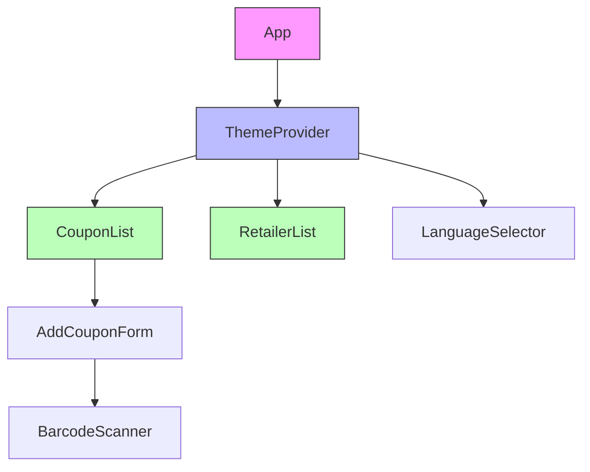
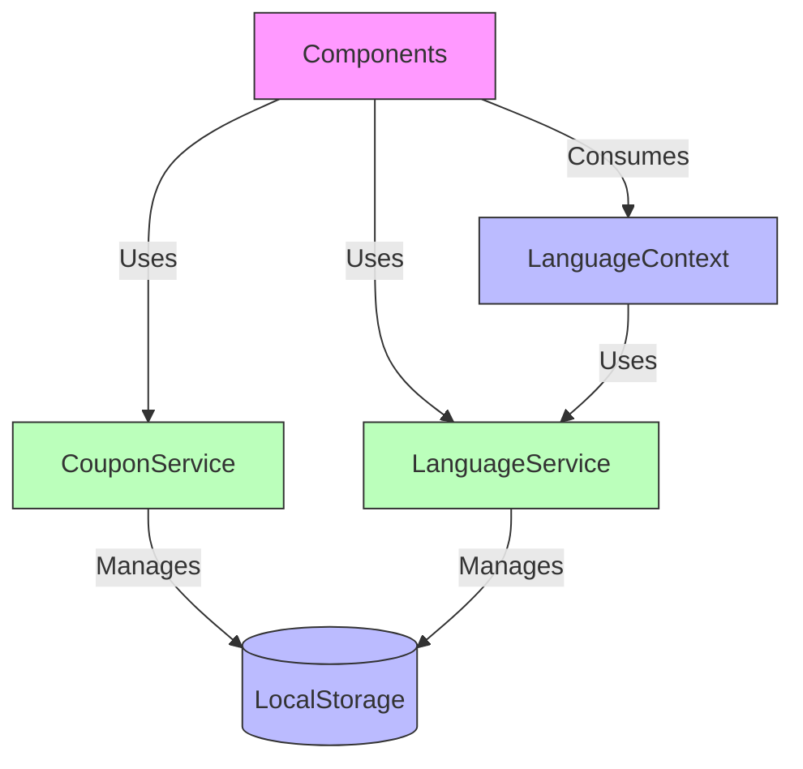
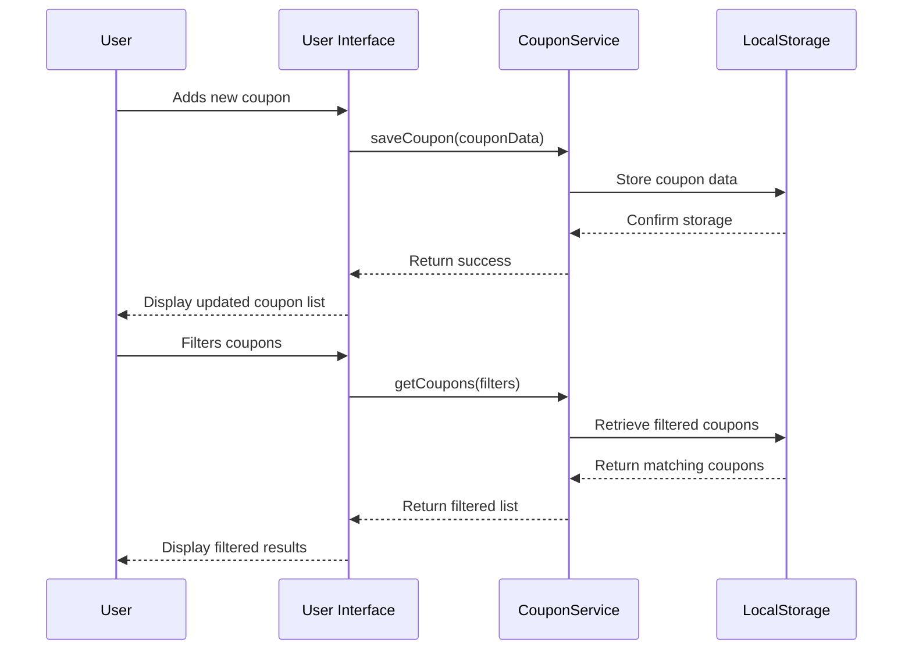

# Architecture for CouponManager

## Status: Approved

## Technical Summary
This architecture defines a modern, responsive web application for managing vouchers and coupons with an intuitive user interface. The CouponManager application is built using React and Material-UI, providing a maintainable and scalable frontend architecture that supports both desktop and mobile viewing experiences. The architecture emphasizes component reusability, clean separation of concerns, and comprehensive test coverage.

## Technology Table

| Technology | Description |
|------------|-------------|
| React 18 | Frontend library for building the user interface |
| Material-UI (MUI) v5 | Component library providing pre-styled UI elements with customizable theming |
| Vite | Build tool and development server with hot module replacement |
| Vitest | Test runner compatible with Vite for unit and integration testing |
| React Testing Library | Testing utilities for React components |
| date-fns | Date manipulation library for handling coupon expiration dates |
| pnpm | Package manager for managing dependencies |
| React Hooks | State management approach using React's built-in hooks |
| react-qr-reader | Library for barcode and QR code scanning |
| JSX/JavaScript | Primary languages for component development |

## Architectural Diagrams

### Component Architecture



### Service Layer Interaction



### User Flow



## Data Models

### Coupon Schema
```javascript
{
  "id": "string", // Unique identifier
  "retailer": "string", // Store or service provider name
  "initialValue": "number", // Original value of the coupon
  "currentValue": "number", // Current/remaining value
  "expirationDate": "Date", // When the coupon expires
  "activationCode": "string", // Code to activate or use the coupon
  "pin": "string", // PIN if required for redemption
  "used": "boolean", // Whether the coupon has been fully used
  "notes": "string", // Additional information
  "addedDate": "Date" // When the coupon was added to the system
}
```

### Retailer Statistics Model
```javascript
{
  "name": "string", // Retailer name
  "totalCoupons": "number", // Count of all coupons
  "activeCoupons": "number", // Count of unused coupons
  "expiredCoupons": "number", // Count of expired coupons
  "totalValue": "number", // Sum of all coupon values
  "activeValue": "number" // Sum of active coupon values
}
```

### Language Service Model
```javascript
{
  "currentLanguage": "string", // Current language code (e.g., "en", "es")
  "translations": "Object", // Key-value pairs of translation strings
  "supportedLanguages": [
    {
      "code": "string", // Language code
      "name": "string" // Display name
    }
  ]
}
```

## Project Structure

```
CouponManager/
├── public/           # Static assets
├── src/
│   ├── components/   # React components
│   │   ├── AddCouponForm.jsx     # Form for adding/editing coupons
│   │   ├── BarcodeScanner.jsx    # Component for scanning coupon barcodes
│   │   ├── CouponList.jsx        # Main coupon display component
│   │   ├── LanguageSelector.jsx  # Component for language selection
│   │   └── RetailerList.jsx      # Retailer statistics component
│   ├── services/     # Service layer for data management
│   │   ├── CouponService.js      # Business logic for coupon operations
│   │   ├── LanguageContext.jsx   # React context for language state
│   │   └── LanguageService.js    # Service for localization
│   ├── test/         # Test files
│   │   ├── components/           # Component tests
│   │   └── services/             # Service tests
│   ├── App.jsx       # Main application component
│   └── index.jsx     # Application entry point
├── docs/             # Documentation
│   ├── architecture.md # Architecture documentation
│   └── prd.md          # Product Requirements Document
├── .cursor/rules/    # Cursor rules for development standards
├── index.html        # HTML template
├── package.json      # Project dependencies and scripts
├── pnpm-lock.yaml    # Lock file for dependencies
└── vite.config.js    # Vite configuration
```

## Change Log

| Change | Story ID | Description |
|--------|----------|-------------|
| Initial Architecture | story-1 | Initial approved system design and documentation |
| Add LanguageService | story-2 | Integration of translation service for internationalization |
| Add BarcodeScanner | story-3 | Implementation of barcode scanning functionality |
| Mobile Optimization | story-4 | Enhanced mobile view with responsive design | 