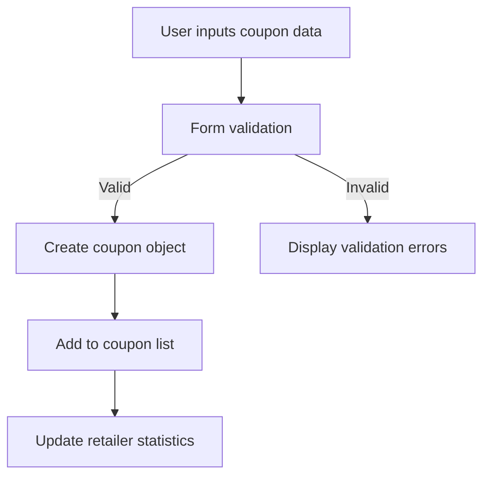
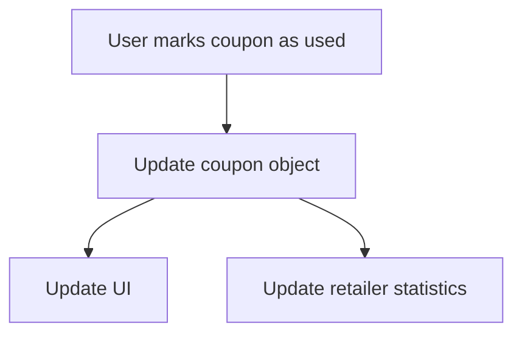

# Data Models Reference for CouponManager

This document provides a comprehensive reference for the data models used throughout the CouponManager application. Understanding these models is essential for developers working on the codebase.

## Coupon Model

The Coupon model represents gift cards, vouchers, and coupons managed by the application.

```typescript
interface Coupon {
  id: string;                // Unique identifier for the coupon
  retailer: string;          // Name of the retailer or brand
  value: string;             // Monetary/discount value (e.g., "$20", "20% off")
  expiryDate?: string;       // Optional expiry date in ISO format (YYYY-MM-DD)
  description?: string;      // Optional description of the coupon
  activationCode: string;    // Unique code to activate/redeem the coupon
  isUsed: boolean;           // Whether the coupon has been used
  dateAdded: string;         // Date the coupon was added to the system (ISO format)
  currency?: string;         // Optional currency code (defaults to USD)
  image?: string;            // Optional URL or base64 data for an image
  barcode?: string;          // Optional barcode identifier
  category?: string;         // Optional category classification
  minimumPurchase?: string;  // Optional minimum purchase requirement
  terms?: string;            // Optional terms and conditions
  lastUpdated?: string;      // Optional date when the coupon was last updated
}
```

### Coupon Validation Rules

- `id`: Auto-generated UUID, should never be manually set
- `retailer`: Required, non-empty string
- `value`: Required, non-empty string
- `activationCode`: Required, unique, non-empty string
- `isUsed`: Default is `false`
- `dateAdded`: Auto-generated timestamp when the coupon is created
- `expiryDate`: Must be a valid ISO date string if provided
- `currency`: Should follow ISO 4217 standard if provided

## Retailer Statistics Model

The RetailerStats model represents aggregated data about retailers in the system.

```typescript
interface RetailerStats {
  name: string;              // Name of the retailer
  count: number;             // Total number of coupons for this retailer
  value: number;             // Total monetary value of all coupons
  unused: number;            // Number of unused coupons
  used: number;              // Number of used coupons
  currency: string;          // Primary currency for this retailer
  earliestExpiry?: string;   // Date of the earliest expiring coupon (ISO format)
}
```

## Filter Model

The Filter model represents the filtering criteria for the coupon list.

```typescript
interface FilterOptions {
  searchTerm: string;        // Text to search across multiple fields
  isUsed: boolean | null;    // Filter by usage status (null means both)
  fromDate: string | null;   // Start date for filtering by expiry (ISO format)
  toDate: string | null;     // End date for filtering by expiry (ISO format)
  retailers: string[];       // Array of retailer names to include
  sortBy: SortOption;        // Current sort option
  sortDirection: 'asc' | 'desc'; // Sort direction
}

type SortOption = 'retailer' | 'value' | 'expiryDate' | 'dateAdded';
```

## Language Model

The Language model represents localization data for the application UI.

```typescript
interface Language {
  code: string;              // ISO language code (e.g., 'en', 'es')
  name: string;              // Display name of the language
  translations: Record<string, string>; // Key-value pairs of translation strings
  isRTL: boolean;            // Whether the language is right-to-left
}

interface LanguageContextType {
  language: string;          // Current language code
  setLanguage: (code: string) => void; // Function to change language
  t: (key: string) => string; // Translation function
  languages: Language[];     // Available languages
}
```

## Theme Model

The Theme model represents the application's theme settings.

```typescript
interface ThemeSettings {
  mode: 'light' | 'dark';    // Current theme mode
  toggleTheme: () => void;   // Function to toggle between light/dark
}
```

## Form Models

### Coupon Form Model

The CouponForm model represents the data entered in the coupon add/edit form.

```typescript
interface CouponFormData {
  retailer: string;
  value: string;
  expiryDate?: string;
  description?: string;
  activationCode: string;
  isUsed: boolean;
  currency?: string;
  category?: string;
  minimumPurchase?: string;
  terms?: string;
}
```

### Form Validation Model

The FormValidation model represents validation state for form fields.

```typescript
interface FormValidation {
  retailer: boolean;
  value: boolean;
  activationCode: boolean;
  isFormValid: boolean;
}
```

## Barcode Model

The Barcode model represents data related to barcode scanning.

```typescript
interface BarcodeData {
  text: string;              // The scanned barcode text
  format: string;            // The format of the barcode (e.g., 'CODE_128')
}

interface BarcodeScannerProps {
  onScan: (data: BarcodeData) => void; // Callback when barcode is scanned
  isActive: boolean;         // Whether the scanner is active
}
```

## Data Flow Diagrams

### Coupon Creation Flow



### Coupon Usage Flow



## Local Storage Schema

The application uses localStorage for data persistence with the following keys:

- `couponManager_coupons`: Array of Coupon objects
- `couponManager_language`: Current language code
- `couponManager_theme`: Current theme setting ('light' or 'dark')
- `couponManager_lastFilter`: Last used filter settings

Example localStorage structure:

```json
{
  "couponManager_coupons": [
    {
      "id": "550e8400-e29b-41d4-a716-446655440000",
      "retailer": "Amazon",
      "value": "$50",
      "expiryDate": "2023-12-31",
      "activationCode": "AMZN-12345-ABCDE",
      "isUsed": false,
      "dateAdded": "2023-01-15T14:30:00Z"
    },
    {
      "id": "550e8400-e29b-41d4-a716-446655440001",
      "retailer": "Starbucks",
      "value": "$20",
      "activationCode": "SB-98765-FGHIJ",
      "isUsed": true,
      "dateAdded": "2023-02-10T09:15:00Z",
      "currency": "USD"
    }
  ],
  "couponManager_language": "en",
  "couponManager_theme": "dark",
  "couponManager_lastFilter": {
    "searchTerm": "",
    "isUsed": null,
    "fromDate": null,
    "toDate": null,
    "retailers": [],
    "sortBy": "dateAdded",
    "sortDirection": "desc"
  }
}
```

## Data Transformation

### Coupon to Display Format

When displaying coupons in the UI, the raw data model is transformed:

```javascript
const displayCoupon = {
  ...coupon,
  expiryDisplay: coupon.expiryDate 
    ? formatDate(coupon.expiryDate) 
    : 'No expiration',
  valueDisplay: coupon.currency 
    ? `${coupon.value} ${coupon.currency}` 
    : coupon.value,
  statusLabel: coupon.isUsed 
    ? 'Used' 
    : isExpired(coupon.expiryDate) ? 'Expired' : 'Active',
  daysUntilExpiry: calculateDaysUntilExpiry(coupon.expiryDate)
};
```

### Statistics Calculation

Retailer statistics are derived from the coupon list:

```javascript
const calculateRetailerStats = (coupons) => {
  const retailers = {};
  
  coupons.forEach(coupon => {
    if (!retailers[coupon.retailer]) {
      retailers[coupon.retailer] = {
        name: coupon.retailer,
        count: 0,
        value: 0,
        unused: 0,
        used: 0,
        currency: coupon.currency || 'USD',
        earliestExpiry: null
      };
    }
    
    const stats = retailers[coupon.retailer];
    stats.count++;
    
    if (coupon.isUsed) {
      stats.used++;
    } else {
      stats.unused++;
      // Only consider numeric values for statistics
      const numericValue = parseFloat(coupon.value.replace(/[^0-9.]/g, ''));
      if (!isNaN(numericValue)) {
        stats.value += numericValue;
      }
      
      // Track earliest expiry date
      if (coupon.expiryDate && (!stats.earliestExpiry || coupon.expiryDate < stats.earliestExpiry)) {
        stats.earliestExpiry = coupon.expiryDate;
      }
    }
  });
  
  return Object.values(retailers);
};
```

## Data Validation Functions

```javascript
const validateCoupon = (coupon) => {
  const errors = {};
  
  if (!coupon.retailer.trim()) {
    errors.retailer = 'Retailer is required';
  }
  
  if (!coupon.value.trim()) {
    errors.value = 'Value is required';
  }
  
  if (!coupon.activationCode.trim()) {
    errors.activationCode = 'Activation code is required';
  }
  
  if (coupon.expiryDate && !isValidDate(coupon.expiryDate)) {
    errors.expiryDate = 'Invalid date format';
  }
  
  return {
    isValid: Object.keys(errors).length === 0,
    errors
  };
};
```

## Guidelines for Model Changes

When modifying data models:

1. Update the relevant interface definitions
2. Update validation functions
3. Update transformation functions
4. Update test fixtures and mocks
5. Consider backward compatibility for existing stored data
6. Document the changes in the changelog 