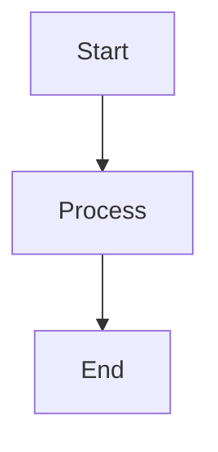
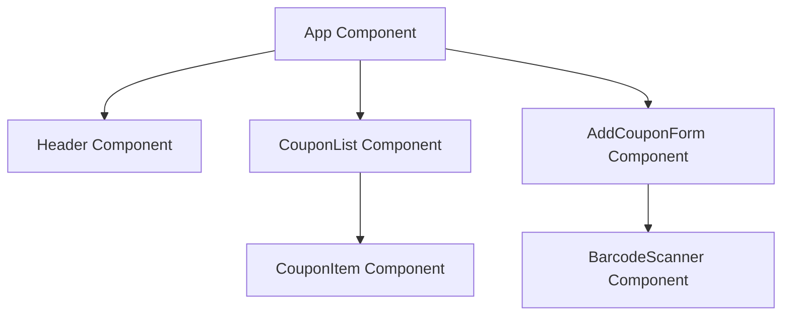
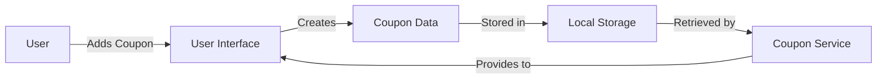
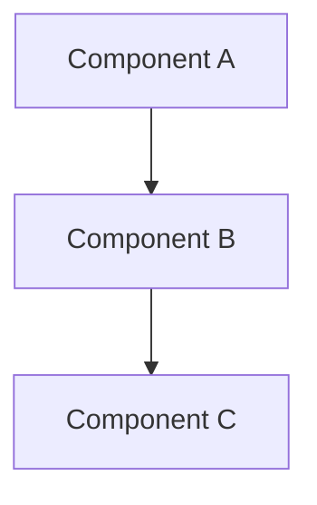

# Working with Diagrams in CouponManager Documentation

## Overview

CouponManager uses Mermaid syntax for creating diagrams in documentation. Mermaid provides a markdown-like syntax for creating various types of diagrams, which are rendered as SVG in compatible markdown viewers (like GitHub) and also converted to PNG images during the build process.

## How Diagram Generation Works

The diagram generation process:

1. Identifies Mermaid code blocks in Markdown files within the `docs/` directory
2. Extracts the diagram code
3. Uses the Mermaid CLI to generate PNG images
4. Saves the images in the `docs/diagrams/` directory

This process is automatically part of the build workflow, ensuring that both text-based diagrams and image equivalents are always available and up-to-date.

## Using Diagrams in Documentation

### Adding a New Diagram

To add a new diagram to the documentation:

1. Create a Mermaid code block in your markdown file:

```markdown

```

2. Run the diagram generation script:

```bash
pnpm generate-diagrams
```

3. The script will create a PNG version in the `docs/diagrams/` directory

### Supported Diagram Types

CouponManager documentation supports all Mermaid diagram types:

- Flowcharts (`graph`)
- Sequence Diagrams (`sequenceDiagram`)
- Class Diagrams (`classDiagram`)
- State Diagrams (`stateDiagram-v2`)
- Entity Relationship Diagrams (`erDiagram`)
- Gantt Charts (`gantt`)
- Pie Charts (`pie`)

## Best Practices

### Diagram Naming Convention

- Diagrams are automatically named based on the source markdown file
- For example, diagrams in `architecture.md` will be named `architecture-diagram-0.png`, `architecture-diagram-1.png`, etc.

### When to Include Diagrams

Include diagrams when:

- Explaining complex component relationships
- Documenting user flows
- Describing data models
- Illustrating state transitions
- Showing the project structure

### Referencing Diagram Images

If you want to explicitly reference the PNG version of a diagram (for platforms that don't support Mermaid):

```markdown

```

## Diagram Maintenance

- Update diagrams when architecture or data models change
- Run `pnpm generate-diagrams` after modifying any diagrams to update the PNG files
- The build process automatically regenerates all diagrams

## Example Diagrams

### Component Diagram



### Data Flow Diagram



## Exporting Documentation with Diagrams

When exporting documentation to formats that don't natively render Mermaid (such as PDF or Word documents), you can include the generated image files:

### Method 1: Side-by-Side Mermaid and Image References

For documentation that might be viewed in different environments, include both the Mermaid code and an image reference:

```markdown
### Component Relationship




```

This approach ensures:
- GitHub and Mermaid-compatible viewers will render the diagram directly
- Non-compatible viewers will display the image
- The source diagram code is still preserved in the document

### Method 2: Using Generated Images in Exported Documents

When creating PDF exports:

1. Run the diagram generation script before export
   ```bash
   pnpm generate-diagrams
   ```

2. Use a Markdown-to-PDF converter that handles image references
   ```bash
   # Using markdown-pdf (example)
   npx markdown-pdf docs/architecture.md
   ```

3. Verify that the images appear correctly in the exported document

## Version Control Considerations

Consider these practices for diagrams and version control:

- **Do**: Commit Mermaid text in Markdown files
- **Do**: Run `pnpm generate-diagrams` before creating releases
- **Consider**: Committing generated diagram images if they rarely change
- **Consider**: Adding `docs/diagrams/` to `.gitignore` if diagrams change frequently

## Troubleshooting

If diagram generation fails:

1. Ensure your Mermaid syntax is correct
2. Check that the Mermaid CLI is installed (`pnpm add -D @mermaid-js/mermaid-cli`)
3. Verify that the script has execution permissions (`chmod +x scripts/generate-diagrams.js`)
4. Run the script manually to see detailed error messages

For advanced diagram needs beyond Mermaid's capabilities, consider using an external diagram tool and importing the images directly. 