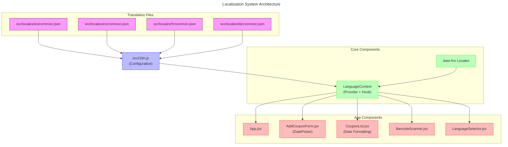

# Translation System Documentation

This document explains the internationalization (i18n) system used in the CouponManager application.

## System Overview

The CouponManager application uses the following technologies for internationalization:

1. `i18next` and `react-i18next` libraries for translation management
2. Translation files organized into separate JSON files per language with nested namespaces
3. Dot notation for translation keys (e.g., `'form.retailer'`)
4. DatePicker with proper internationalization support using `date-fns` locales
5. Locale-aware date formatting throughout the application
6. Full translation of all UI elements including instructions and error messages

## Architecture Overview



## Key Files Structure

- `src/i18n.js` - i18next configuration file that loads translations and configures the library
- `src/locales/[lang]/common.json` - language-specific translation files in JSON format
- `src/services/LanguageContext.jsx` - React context that provides translation functionality to components
- `src/components/LanguageSelector.jsx` - UI component for selecting application language

## Using Translations in Components

To use translations in a component:

1. Import the `useLanguage` hook: `import { useLanguage } from '../services/LanguageContext'`
2. Access the translation function: `const { t, language } = useLanguage()`
3. Use the `t` function with the appropriate key: `t('namespace.key')`

### Example Component with Translations

```javascript
import React from 'react';
import { useLanguage } from '../services/LanguageContext';

const MyComponent = () => {
  const { t } = useLanguage();
  
  return (
    <div>
      <h1>{t('app.title')}</h1>
      <p>{t('messages.welcome')}</p>
      <button>{t('actions.save')}</button>
    </div>
  );
};

export default MyComponent;
```

## Translation Namespaces

Translations are organized into logical namespaces to keep the translation files manageable:

| Namespace | Description | Examples |
|-----------|-------------|----------|
| `app` | Application-level terms | app.coupon_manager, app.add_coupon, app.user_management |
| `form` | Form field labels | form.retailer, form.initial_value |
| `actions` | Action buttons and links | actions.save, actions.edit |
| `filter` | Filtering options | filter.filter_by_retailer |
| `status` | Status indicators | status.active, status.expired |
| `general` | General purpose terms | general.total_value |
| `tables` | Table-specific terms | tables.expires, tables.actions |
| `errors` | Error messages | errors.invalid_qr_format |
| `dialog` | Dialog content | dialog.enter_amount_to_use |
| `messages` | Notification messages | messages.no_coupons_found |
| `notifications` | Toast notifications | notifications.copied_to_clipboard |
| `login` | Authentication related | login.sign_in, login.password_label |
| `admin` | User management | admin.user_management, admin.user_id |
| `roles` | User roles | roles.user, roles.manager |

## Recent Translation Additions

The application recently added translations for the User Management functionality, with these key namespaces:

1. **admin**: Translations for the User Management interface
   - Column headers: user_id, email, created_at, role, actions
   - Actions: promote_to_manager, demote_to_user

2. **roles**: Translations for user role names
   - user: Standard user role
   - manager: Administrator role
   - demo_user: Limited demo user role

3. **errors**: Additional error messages for permission handling
   - access_denied: Shown when a user tries to access a restricted area
   - permission_denied: Shown when a user lacks permissions for an action
   - fetch_users_failed: Shown when user list cannot be retrieved
   - role_update_failed: Shown when role update fails
   - cannot_change_own_role: Shown when trying to change own role

These translations are available in all supported languages.

## Translation Files

Translation files are stored in the `src/locales/{language}/common.json` format. Each language has its own directory:

```
src/
  locales/
    en/
      common.json    # English translations
    es/
      common.json    # Spanish translations
    fr/
      common.json    # French translations
    de/
      common.json    # German translations
```

## Using Translations

### Basic Usage

To use translations in components:

```jsx
import { useLanguage } from '../services/LanguageContext';

function MyComponent() {
  const { t } = useLanguage();

  return (
    <div>
      <h1>{t('app.coupon_manager')}</h1>
      <p>{t('messages.no_coupons_found')}</p>
    </div>
  );
}
```

### Date Formatting

The application uses `date-fns` in combination with the current language setting to format dates:

```jsx
import { format } from 'date-fns';
import { enUS, es, fr, de } from 'date-fns/locale';

const localeMap = {
  en: enUS,
  es: es,
  fr: fr,
  de: de
};

// In a component
const formattedDate = format(
  date, 
  'PP', 
  { locale: localeMap[language] || enUS }
);
```

## Switching Languages

Users can change the application language using the language selector in the top navigation bar. This component uses the `useLanguage` hook:

```jsx
const { language, changeLanguage } = useLanguage();

// Change language
changeLanguage('es'); // Switch to Spanish
```

## Adding New Translations

To add a new translation:

1. Add the translation key and value to `src/locales/en/common.json`
2. Add the corresponding translations in the other language files

Example:

```json
// In src/locales/en/common.json
{
  "new_namespace": {
    "new_key": "New translation"
  }
}

// In src/locales/es/common.json
{
  "new_namespace": {
    "new_key": "Nueva traducción"
  }
}
```

## Translation Fallbacks

If a translation is missing in a language, the system will fallback to the English version. Make sure all keys present in the English file are also present in other language files to avoid inconsistent UI.

## Language Detection

The application automatically detects the user's preferred language from their browser settings on first load. If the preferred language is supported, it will be used; otherwise, English is used as the default.

## Adding a New Language

To add support for a new language:

1. Create a new directory in `src/locales/` with the language code
2. Copy the structure of the English translations
3. Translate all keys to the new language
4. Add the language to the language selector component
5. Add the language to the date-fns locale map

## Best Practices

1. Keep translation keys organized in appropriate namespaces
2. Use descriptive, consistent naming for translation keys
3. Avoid hardcoded text in components - always use the translation system
4. Include placeholders in translations where needed
5. Test UI with all supported languages to check for layout issues

## Date Localization

The application properly localizes dates throughout the UI using two main approaches:

### 1. DatePicker Localization

```javascript
// Import necessary components and locales
import { AdapterDateFns } from '@mui/x-date-pickers/AdapterDateFns';
import { LocalizationProvider } from '@mui/x-date-pickers/LocalizationProvider';
import { DatePicker } from '@mui/x-date-pickers/DatePicker';
import { enUS, es, fr, de } from 'date-fns/locale';

// Create a locale mapping
const localeMap = {
  en: enUS,
  es: es,
  fr: fr,
  de: de
};

// Use the current language from the language context
const { t, language } = useLanguage();

// Implement the DatePicker with proper localization
<LocalizationProvider dateAdapter={AdapterDateFns} adapterLocale={localeMap[language] || enUS}>
  <DatePicker
    label={t('form.expiration_date')}
    value={date}
    onChange={handleDateChange}
    slotProps={{
      textField: {
        margin: "normal",
        fullWidth: true
      }
    }}
  />
</LocalizationProvider>
```

### 2. Locale-Aware Date Formatting

```javascript
// Import necessary functions and locales
import { format } from 'date-fns';
import { enUS, es, fr, de } from 'date-fns/locale';

// Create a locale mapping
const localeMap = {
  en: enUS,
  es: es,
  fr: fr,
  de: de
};

// Format date with locale-appropriate pattern
const formatDate = (date) => {
  try {
    // Get date format based on locale
    const dateFormat = language === 'en' ? 'MM/dd/yyyy' : 
                        language === 'de' || language === 'fr' ? 'dd.MM.yyyy' : 
                        'dd/MM/yyyy';
    
    return format(new Date(date), dateFormat, { 
      locale: localeMap[language] || enUS 
    });
  } catch (error) {
    return t('general.invalid_date');
  }
};
```

## Date Format Standards By Locale

| Language | Locale Code | Date Format | Example |
|:---------|:----------:|:----------:|:--------:|
| English  | en         | MM/dd/yyyy | 03/15/2023 |
| Spanish  | es         | dd/MM/yyyy | 15/03/2023 |
| French   | fr         | dd.MM.yyyy | 15.03.2023 |
| German   | de         | dd.MM.yyyy | 15.03.2023 |

> ℹ️ **Note:** The date formats above are standard in the respective locales, but can be customized as needed.

## UI Component Localization Examples

### Barcode Scanner

The barcode scanner component uses translations for all user-facing content:

```javascript
// In BarcodeScanner.jsx
const { t } = useLanguage();

// Error messages
setError(t('errors.invalid_qr_format'));
setError(`${t('errors.error_accessing_camera')}: ${err}`);

// UI text
<DialogTitle>{t('actions.scan_barcode')}</DialogTitle>
<Typography variant="body2" color="text.secondary">
  {t('dialog.barcode_scanning_instruction')}
</Typography>
<Button onClick={onClose}>{t('actions.cancel')}</Button>
```

> ℹ️ **Note:** All user-facing text should be translated, including error messages, tooltips, and instructions.

## Features and Benefits

1. **Industry Standard**: Uses i18next, a standard in the React ecosystem
2. **Scalable**: Easy to add new languages and manage large translation sets
3. **Organized**: Translations structured by namespaces for better management
4. **Feature-rich**: Supports plural forms, formatting, and other i18next features
5. **Complete**: All UI elements, including date pickers and notifications, are localized
6. **Maintainable**: Independent files per language make maintenance easier

## Additional Resources

- [i18next Documentation](https://www.i18next.com/)
- [react-i18next Documentation](https://react.i18next.com/)
- [date-fns Localization](https://date-fns.org/docs/I18n)
- [MUI X Date Pickers Localization](https://mui.com/x/react-date-pickers/localization/) 