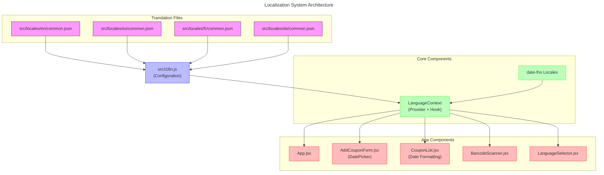

# Translation System Documentation

This document explains the internationalization (i18n) system used in the CouponManager application.

## System Overview

The CouponManager application uses the following technologies for internationalization:

1. `i18next` and `react-i18next` libraries for translation management
2. Translation files organized into separate JSON files per language with nested namespaces
3. Dot notation for translation keys (e.g., `'form.retailer'`)
4. DatePicker with proper internationalization support using `date-fns` locales
5. Locale-aware date formatting throughout the application
6. Full translation of all UI elements including instructions and error messages

## Architecture Overview



## Key Files Structure

- `src/i18n.js` - i18next configuration file that loads translations and configures the library
- `src/locales/[lang]/common.json` - language-specific translation files in JSON format
- `src/services/LanguageContext.jsx` - React context that provides translation functionality to components
- `src/components/LanguageSelector.jsx` - UI component for selecting application language

## Using Translations in Components

To use translations in a component:

1. Import the `useLanguage` hook: `import { useLanguage } from '../services/LanguageContext'`
2. Access the translation function: `const { t, language } = useLanguage()`
3. Use the `t` function with the appropriate key: `t('namespace.key')`

### Example Component with Translations

```javascript
import React from 'react';
import { useLanguage } from '../services/LanguageContext';

const MyComponent = () => {
  const { t } = useLanguage();
  
  return (
    <div>
      <h1>{t('app.title')}</h1>
      <p>{t('messages.welcome')}</p>
      <button>{t('actions.save')}</button>
    </div>
  );
};

export default MyComponent;
```

## Translation Namespaces

Translations are organized into the following namespaces:

- `app` - App-level strings like "Coupon Manager", "Add Coupon"
- `form` - Form field labels: "Retailer", "Initial Value", etc.
- `actions` - Action buttons: "Save", "Cancel", "Edit", etc.
- `filter` - Filter-related texts
- `status` - Status labels: "Active", "Expired", "Used"
- `general` - Common texts that don't fit other categories
- `tables` - Table headers and related texts
- `errors` - Error messages
- `dialog` - Texts used in dialogs, including scanner instructions
- `messages` - User-facing messages like "No items found"
- `notifications` - Notification messages like "Copied to clipboard!"

> 💡 **Tip:** When adding new translations, always consider which namespace they belong to for consistency.

### Translation Key Examples

```javascript
// Application title
t('app.title')  // "Coupon Manager"

// Form fields
t('form.retailer')  // "Retailer"
t('form.initial_value')  // "Initial Value"

// Action buttons
t('actions.save')  // "Save"
t('actions.cancel')  // "Cancel"

// Error messages
t('errors.required_field')  // "This field is required"
```

## Date Localization

The application properly localizes dates throughout the UI using two main approaches:

### 1. DatePicker Localization

```javascript
// Import necessary components and locales
import { AdapterDateFns } from '@mui/x-date-pickers/AdapterDateFns';
import { LocalizationProvider } from '@mui/x-date-pickers/LocalizationProvider';
import { DatePicker } from '@mui/x-date-pickers/DatePicker';
import { enUS, es, fr, de } from 'date-fns/locale';

// Create a locale mapping
const localeMap = {
  en: enUS,
  es: es,
  fr: fr,
  de: de
};

// Use the current language from the language context
const { t, language } = useLanguage();

// Implement the DatePicker with proper localization
<LocalizationProvider dateAdapter={AdapterDateFns} adapterLocale={localeMap[language] || enUS}>
  <DatePicker
    label={t('form.expiration_date')}
    value={date}
    onChange={handleDateChange}
    slotProps={{
      textField: {
        margin: "normal",
        fullWidth: true
      }
    }}
  />
</LocalizationProvider>
```

### 2. Locale-Aware Date Formatting

```javascript
// Import necessary functions and locales
import { format } from 'date-fns';
import { enUS, es, fr, de } from 'date-fns/locale';

// Create a locale mapping
const localeMap = {
  en: enUS,
  es: es,
  fr: fr,
  de: de
};

// Format date with locale-appropriate pattern
const formatDate = (date) => {
  try {
    // Get date format based on locale
    const dateFormat = language === 'en' ? 'MM/dd/yyyy' : 
                        language === 'de' || language === 'fr' ? 'dd.MM.yyyy' : 
                        'dd/MM/yyyy';
    
    return format(new Date(date), dateFormat, { 
      locale: localeMap[language] || enUS 
    });
  } catch (error) {
    return t('general.invalid_date');
  }
};
```

## Date Format Standards By Locale

| Language | Locale Code | Date Format | Example |
|:---------|:----------:|:----------:|:--------:|
| English  | en         | MM/dd/yyyy | 03/15/2023 |
| Spanish  | es         | dd/MM/yyyy | 15/03/2023 |
| French   | fr         | dd.MM.yyyy | 15.03.2023 |
| German   | de         | dd.MM.yyyy | 15.03.2023 |

> ℹ️ **Note:** The date formats above are standard in the respective locales, but can be customized as needed.

## UI Component Localization Examples

### Barcode Scanner

The barcode scanner component uses translations for all user-facing content:

```javascript
// In BarcodeScanner.jsx
const { t } = useLanguage();

// Error messages
setError(t('errors.invalid_qr_format'));
setError(`${t('errors.error_accessing_camera')}: ${err}`);

// UI text
<DialogTitle>{t('actions.scan_barcode')}</DialogTitle>
<Typography variant="body2" color="text.secondary">
  {t('dialog.barcode_scanning_instruction')}
</Typography>
<Button onClick={onClose}>{t('actions.cancel')}</Button>
```

> ℹ️ **Note:** All user-facing text should be translated, including error messages, tooltips, and instructions.

## Features and Benefits

1. **Industry Standard**: Uses i18next, a standard in the React ecosystem
2. **Scalable**: Easy to add new languages and manage large translation sets
3. **Organized**: Translations structured by namespaces for better management
4. **Feature-rich**: Supports plural forms, formatting, and other i18next features
5. **Complete**: All UI elements, including date pickers and notifications, are localized
6. **Maintainable**: Independent files per language make maintenance easier

## Adding a New Language

To add a new language:

1. Create a new JSON file in `src/locales/[lang_code]/common.json`
2. Add the language to the supported languages list in `src/i18n.js`
3. Add the locale to the `localeMap` in components that use date formatting

## Additional Resources

- [i18next Documentation](https://www.i18next.com/)
- [react-i18next Documentation](https://react.i18next.com/)
- [date-fns Localization](https://date-fns.org/docs/I18n)
- [MUI X Date Pickers Localization](https://mui.com/x/react-date-pickers/localization/) 