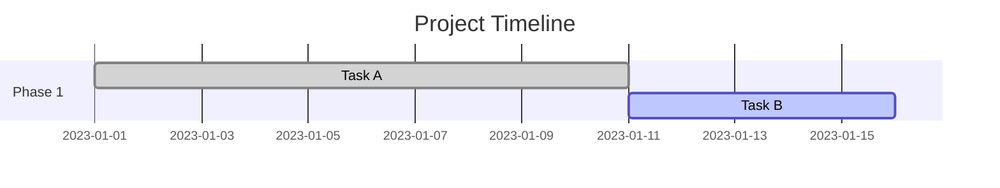
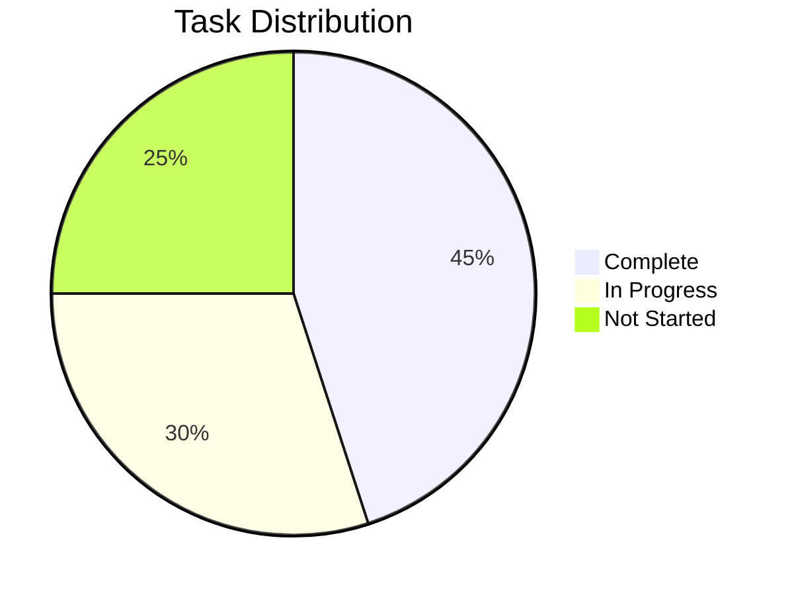
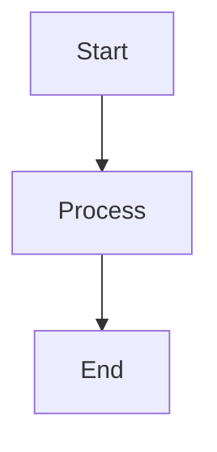

# Project Status Documentation Guide

This directory contains the project status documentation for the CouponManager project. This README explains how to use and maintain these documents.

## Overview

The project status documentation system is designed to provide a clear, structured, and up-to-date view of the project's status, including:

- Overall project health and progress
- Upcoming work and priorities
- Current blockers and challenges
- Requests for assistance

## Document Structure

The project status documentation consists of the following files:

1. **status-board.md** - A high-level dashboard view of the project status
2. **status.md** - Detailed project status report
3. **todo.md** - List of pending work items with priorities
4. **blockers.md** - Documentation of obstacles impeding progress
5. **help-requests.md** - Formalized requests for assistance

## How to Use These Documents

### For Team Members

1. **Check status-board.md first** for the most critical information
2. **Update documents according to the schedule**:
   - `status.md` - Weekly (every Monday)
   - `todo.md` - When tasks are completed or added (minimum weekly)
   - `blockers.md` - Immediately when blockers arise or are resolved
   - `help-requests.md` - As requests are made or fulfilled

3. **Follow the standardized format** for each document type
4. **Include diagrams** where appropriate to visualize data
5. **Keep resolved items** for historical reference (according to retention periods)

### For Project Leads

1. **Review all status documents** at least weekly
2. **Ensure the status-board.md** is updated to reflect the current state
3. **Facilitate resolution** of blockers and help requests
4. **Reference these documents** in status meetings
5. **Archive outdated information** to maintain document clarity

### For Stakeholders

1. **Start with status-board.md** for a quick overview
2. **Refer to specific documents** for detailed information on areas of interest
3. **Track milestones and goals** in the status document
4. **Monitor blockers** that may impact delivery timelines

## How to Update These Documents

### Updating Status

1. Edit `status.md` with current information
2. Update all sections, particularly:
   - Current status (On Track, At Risk, Blocked)
   - Recent accomplishments
   - Current focus
   - Upcoming milestones
   - Health metrics
3. Generate updated diagrams if needed
4. Update the "Last Updated" timestamp and your name

### Updating Todo Items

1. Edit `todo.md` to:
   - Add new tasks with appropriate priority
   - Mark completed tasks with [x]
   - Move completed tasks to the "Completed" section
   - Update due dates if necessary
2. Include all required information for each task:
   - Clear description
   - Assigned owner
   - Due date
   - Related issue/PR links
   - Tags for categorization

### Documenting Blockers

1. Edit `blockers.md` to:
   - Add new blockers with impact assessment
   - Update status of existing blockers
   - Move resolved blockers to the "Resolved" section
2. For new blockers, include:
   - Clear description of the issue
   - Impact assessment
   - Owner responsible for resolution
   - Action plan
   - Target resolution date
   - Dependencies

### Requesting Help

1. Edit `help-requests.md` to:
   - Add new requests with appropriate urgency
   - Update status of existing requests
   - Move fulfilled requests to "Resolved"
2. For new requests, include:
   - Clear description of assistance needed
   - Required expertise
   - Requesting team member
   - Business justification
   - Target response date

## Using Mermaid Diagrams

The status documents support Mermaid diagrams for visualizing data:

1. Use Gantt charts for timelines:
```

```

2. Use Pie charts for distributions:
```

```

3. Use Flow charts for processes:
```

```

## Best Practices

1. **Be concise but thorough** - Provide enough detail to be useful without overwhelming
2. **Use consistent formatting** - Follow the established templates
3. **Update regularly** - Outdated information reduces the value of these documents
4. **Include actionable information** - Focus on what needs to be done
5. **Keep historical data** - Don't delete resolved items immediately
6. **Use links** - Connect related information across documents
7. **Include metrics** - Quantify status where possible

## Questions?

If you have questions about how to use or maintain these documents, please contact @project-lead. 