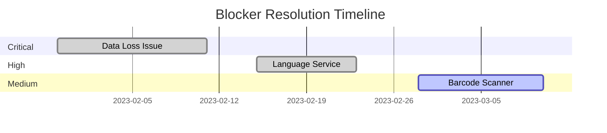

# CouponManager Blockers

Last Updated: 2023-03-03 by @project-lead

## Active Blockers

*Currently there are no active blockers.*

<!-- Example of an active blocker:
### [Critical] Mobile performance degradation on complex coupon lists

**Description**: When loading more than 100 coupons on mobile devices, significant lag is observed in the UI, making the application unusable for users with large coupon collections.

**Impact**: Critical - Affects core functionality for a key user segment.

**Owner**: @mobile-dev

**Identified**: 2023-03-01

**Target Resolution**: 2023-03-08

**Action Plan**:
1. Profile app performance on mobile devices to identify bottlenecks
2. Implement virtualization for the coupon list to reduce DOM elements
3. Optimize rendering by implementing shouldComponentUpdate or React.memo
4. Reduce unnecessary re-renders using useCallback and useMemo hooks
5. Consider pagination as a fallback solution

**Dependencies**:
- None

**Status Updates**:
- 2023-03-01: Issue identified through user feedback and confirmed in testing
- 2023-03-02: Initial profiling completed, identified main bottleneck in re-renders
- 2023-03-03: Virtualization implementation started
-->

## Monitoring

### [Medium] Barcode scanner compatibility with certain Android devices

**Description**: Some users with specific Android device models (primarily Samsung A-series) report intermittent failures when using the barcode scanner feature.

**Impact**: Medium - Feature is still usable but causes frustration for affected users.

**Owner**: @mobile-dev

**Identified**: 2023-02-28

**Action Plan**:
1. Gather specific device information from affected users
2. Set up testing environment with similar device configurations
3. Implement more detailed error logging during scanner activation
4. Research alternative barcode scanning libraries for compatibility
5. Apply fixes based on findings or implement device-specific fallbacks

**Status**:
- Currently gathering device information from affected users
- Testing on Samsung A52 device shows intermittent issues at certain angles and lighting conditions

## Resolved Blockers

### [High] Language service memory leak

**Description**: The language service was causing memory leaks when switching languages multiple times, eventually leading to performance degradation.

**Impact**: High - Affected users who frequently switch language settings.

**Owner**: @backend-dev

**Identified**: 2023-02-15

**Resolved**: 2023-02-22

**Resolution**:
Implemented proper cleanup of event listeners in the language context provider and refactored the translation caching mechanism to properly dispose of outdated translations. Verified fix through extended stress testing and memory profiling.

**Root Cause Analysis**:
The issue was caused by improper event listener cleanup in the language context and accumulation of translation objects in memory that weren't being garbage collected due to circular references.

### [Critical] Data loss when browser storage limit reached

**Description**: Users with large coupon collections experienced data loss when the browser's local storage limit was reached.

**Impact**: Critical - Resulted in permanent data loss for affected users.

**Owner**: @backend-dev

**Identified**: 2023-01-30

**Resolved**: 2023-02-10

**Resolution**:
1. Implemented storage limit detection before write operations
2. Added compression for stored data to reduce storage footprint
3. Created automatic export functionality when approaching storage limits
4. Added warning notifications to users approaching storage limits
5. Implemented data chunking to avoid single large storage objects

**Prevention Measures**:
1. Added comprehensive storage monitoring
2. Implemented automated testing for storage edge cases
3. Created documentation for users about storage limitations and export options

## Blocker Metrics

### Monthly Blocker Summary

| Month | Critical | High | Medium | Low | Avg. Resolution Time |
|-------|----------|------|--------|-----|----------------------|
| January | 1 | 2 | 1 | 3 | 8.5 days |
| February | 0 | 1 | 1 | 2 | 6.2 days |
| March (to date) | 0 | 0 | 1 | 0 | N/A |

## Notes

- We should consider setting up a dedicated testing environment for mobile devices to catch device-specific issues earlier
- The team has been effective at resolving blockers quickly, with average resolution time decreasing month-over-month
- Regular testing on a wider range of devices could help identify potential blockers before they affect users 