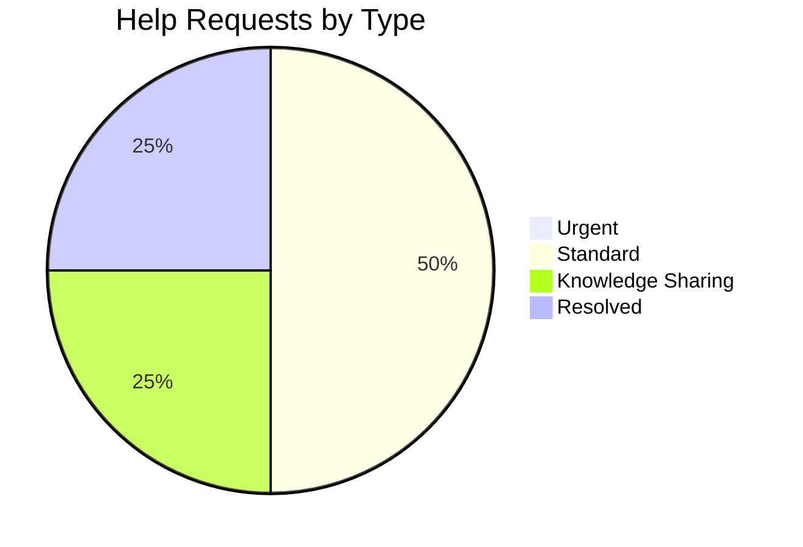

# CouponManager Help Requests

Last Updated: 2023-03-03 by @project-lead

## Urgent Requests

*There are currently no urgent help requests.*

<!-- Example of an urgent request:
### [Urgent] Need immediate assistance with CI pipeline failure

**Description**: Our CI pipeline is failing on all PRs with a mysterious error related to the testing environment. All development is blocked until this is resolved.

**Required Expertise**: DevOps, CI/CD configuration, testing environment setup

**Requesting Team Member**: @frontend-dev

**Business Justification**: All development is blocked, preventing any progress on upcoming milestones.

**Target Response Date**: 2023-03-03 (Today)

**Current Status**: Open

**Assigned To**: Unassigned
-->

## Standard Requests

### [Standard] Need assistance with optimizing database queries

**Description**: We need help optimizing our localStorage query patterns for large datasets. Current implementation becomes slow when users have more than 200 coupons.

**Required Expertise**: JavaScript performance optimization, IndexedDB, browser storage

**Requesting Team Member**: @backend-dev

**Business Justification**: Performance improvement for users with large coupon collections, which represents about 15% of our user base according to analytics.

**Target Response Date**: 2023-03-10

**Current Status**: In Progress

**Assigned To**: @database-expert

**Progress Notes**:
- 2023-03-02: Initial discussion held, identified potential approaches
- 2023-03-03: Benchmark testing set up to evaluate different storage strategies

### [Standard] Request review of accessibility implementation

**Description**: Need an accessibility expert to review our current implementation and provide feedback on WCAG 2.1 compliance, particularly for screen reader compatibility.

**Required Expertise**: Web accessibility, WCAG 2.1 standards, screen reader testing

**Requesting Team Member**: @ui-designer

**Business Justification**: Ensure application is usable by all users and compliant with accessibility standards.

**Target Response Date**: 2023-03-15

**Current Status**: Open

**Assigned To**: Unassigned

## Knowledge Sharing

### [Knowledge] Request for Material-UI best practices workshop

**Description**: Our team would benefit from a workshop on Material-UI best practices, particularly around theming, performance optimization, and component customization.

**Required Expertise**: Material-UI, React component optimization

**Requesting Team Member**: @project-lead

**Business Justification**: Improve team knowledge and efficiency with our UI framework, resulting in better code quality and faster development.

**Target Response Date**: 2023-03-30

**Current Status**: Open

**Assigned To**: Unassigned

**Format Preference**: 2-hour virtual workshop with hands-on examples

## Resolved Requests

### [Standard] Assistance with barcode scanner integration

**Description**: We need help integrating the barcode scanner library with our React application, specifically handling camera permissions and device compatibility.

**Required Expertise**: React, mobile web development, barcode scanning libraries

**Requesting Team Member**: @mobile-dev

**Business Justification**: Key feature for upcoming release, essential for improving user experience.

**Target Response Date**: 2023-02-20

**Resolution Date**: 2023-02-18

**Assigned To**: @external-consultant

**Resolution**: 
@external-consultant provided a detailed implementation guide and example code for integrating the barcode scanner library. They also helped troubleshoot permission issues across different browsers and devices. The solution has been successfully implemented and is working well in our testing environments.

**Lessons Learned**:
- Need better documentation for device-specific behaviors
- Should establish a more comprehensive testing environment for hardware-dependent features
- Consider creating a more abstracted interface for hardware features in the future

## Help Request Metrics

### Response Time Analysis

| Month | Urgent (avg. days) | Standard (avg. days) | Knowledge (avg. days) | Overall |
|-------|-------------------|---------------------|----------------------|---------|
| January | 0.5 | 3.2 | 7.5 | 3.7 |
| February | 0.7 | 2.8 | 6.0 | 3.2 |
| March (to date) | N/A | In progress | In progress | N/A |

## Notes

- We should consider establishing an internal knowledge-sharing program to reduce dependency on external expertise
- For urgent requests, consider setting up a dedicated Slack channel for faster response
- Documentation of resolved requests is helping to build an internal knowledge base 