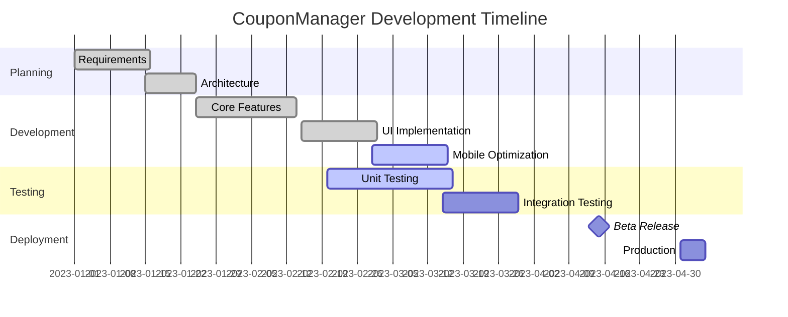

# Project Status Board

Last Updated: 2023-03-03

## Overall Status: ON TRACK

## Active Blockers: 0
- None currently

## Todo Items: 3/15 completed
- [High] 2 remaining
- [Medium] 5 remaining
- [Low] 5 remaining

## Help Requests: 1 open
- [Standard] Need assistance with optimizing database queries (@database-expert)

## Recent Achievements
- Implemented barcode scanning feature (completed 2023-02-28)
- Fixed mobile layout issues (completed 2023-02-25)
- Improved test coverage to 80% (completed 2023-02-20)

## Next Milestone: Beta Release (2023-04-15)

## Timeline

## Sprint Progress

| Sprint | Goals Met | Tests Passing | Test Coverage | Open Issues |
|--------|-----------|---------------|--------------|-------------|
| Sprint 1 | 8/8 | 85% | 70% | 5 |
| Sprint 2 | 7/8 | 92% | 75% | 8 |
| Sprint 3 | 6/7 | 95% | 80% | 7 |
| Current | 3/8 | 97% | 80% | 12 |

*View detailed status documents:*
- [Full Status Report](./status.md)
- [Todo List](./todo.md)
- [Blockers](./blockers.md)
- [Help Requests](./help-requests.md) 