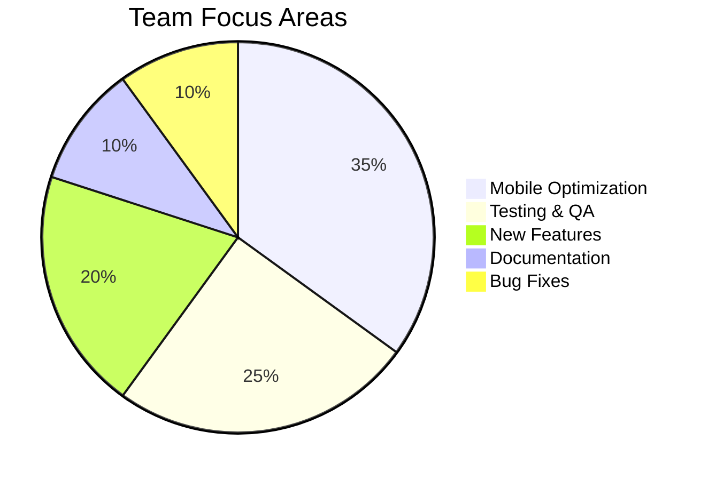

# CouponManager Project Status

Last Updated: 2023-03-03 by @project-lead

## Current Status: ON TRACK

### Summary

The CouponManager project is currently on track with all major milestones. The team has successfully implemented the core features including coupon management, filtering, and barcode scanning capabilities. Mobile optimization is progressing well, though we've identified some performance improvements needed for the coupon list on lower-end devices. Test coverage has reached the target 80% threshold, and we're continuing to expand test coverage for new features.

### Recent Accomplishments

- Implemented barcode scanning feature for quick coupon entry
- Fixed responsive layout issues on smaller mobile devices
- Improved database query performance for large coupon collections
- Added multilingual support with English and Spanish translations
- Completed documentation for current features and architecture
- Integrated diagram generation into the build process

### Current Focus

The team is currently focused on:

1. Optimizing the performance of the coupon list for mobile devices
2. Completing integration testing for the barcode scanning feature
3. Implementing notification features for expiring coupons
4. Enhancing retailer statistics with visualization components
5. Expanding test coverage for edge cases

### Upcoming Milestones

| Milestone | Target Date | Status | Owner |
|-----------|-------------|--------|-------|
| Mobile Optimization | 2023-03-15 | On Track | @mobile-lead |
| Notification System | 2023-03-30 | On Track | @frontend-dev |
| Analytics Dashboard | 2023-04-10 | Not Started | @ui-designer |
| Beta Release | 2023-04-15 | On Track | @project-lead |
| Production Release | 2023-05-01 | On Track | @project-lead |

### Health Metrics

| Metric | Current | Change | Target | Status |
|--------|---------|--------|--------|--------|
| Test Coverage | 80% | +5% | 80% | ✅ Met |
| Open Issues | 12 | +2 | <10 | ⚠️ Above Target |
| PR Velocity | 3.2 PRs/day | +0.5 | 3.0 | ✅ Above Target |
| Build Status | Passing | No Change | Passing | ✅ Met |
| Code Quality | 8.5/10 | +0.2 | 8.0/10 | ✅ Above Target |

### Risk Assessment

| Risk | Likelihood | Impact | Mitigation |
|------|------------|--------|------------|
| Browser compatibility issues | Medium | Medium | Expand testing to include IE11 and older Safari versions |
| Mobile performance degradation | High | Medium | Implement virtualization for the coupon list |
| Localization completeness | Low | Low | Engage community translators for additional languages |

### Resource Allocation

Current team resource allocation:

### Notes from Recent Sprint Review

- The barcode scanning feature has received positive feedback from test users
- Mobile optimization is proceeding well but requires additional focus
- We need to improve error messaging for failed API operations
- The retailer statistics feature has been highlighted as particularly useful

### Action Items

1. Schedule a performance review session for mobile optimization (@mobile-lead, Due: 2023-03-08)
2. Create a test plan for notification system (@qa-engineer, Due: 2023-03-10)
3. Investigate browser compatibility issues in Safari (@frontend-dev, Due: 2023-03-15)
4. Review and triage open issues (@project-lead, Due: 2023-03-07) 