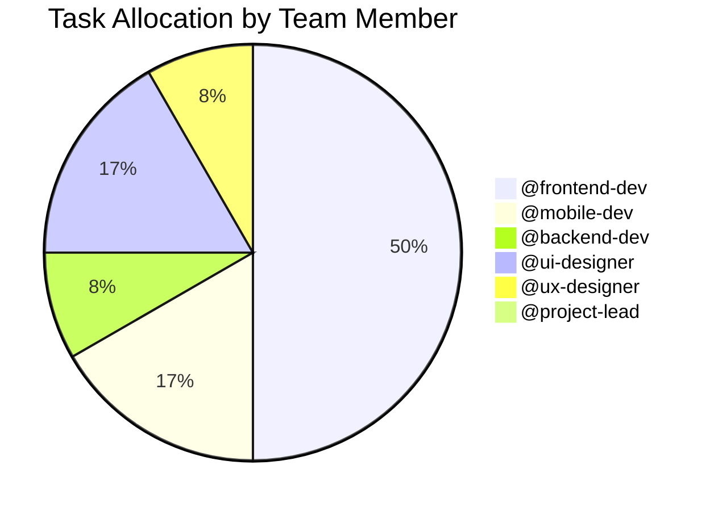

# CouponManager Todo List

Last Updated: 2023-03-03 by @project-lead

## High Priority

- [ ] Optimize rendering performance for coupon list on mobile devices (#45) @frontend-dev [Due: 2023-03-10] #performance #mobile
- [ ] Fix intermittent connection error with barcode scanner on Android (#52) @mobile-dev [Due: 2023-03-12] #bug #critical

## Medium Priority

- [ ] Add notification system for expiring coupons (#38) @frontend-dev [Due: 2023-03-20] #feature
- [ ] Implement data visualization for retailer statistics (#40) @ui-designer [Due: 2023-03-25] #enhancement
- [ ] Create user onboarding guide for first-time users (#43) @ux-designer [Due: 2023-03-28] #documentation
- [ ] Add keyboard shortcuts for common actions (#47) @frontend-dev [Due: 2023-04-05] #accessibility
- [ ] Implement dark mode for barcode scanner overlay (#49) @mobile-dev [Due: 2023-04-08] #enhancement

## Low Priority

- [ ] Refactor language service for better code organization (#41) @backend-dev [Due: 2023-04-10] #refactoring
- [ ] Create advanced search options for coupons (#44) @frontend-dev [Due: 2023-04-15] #feature
- [ ] Add animation for coupon status transitions (#46) @ui-designer [Due: 2023-04-18] #enhancement
- [ ] Implement bulk actions for coupon management (#48) @frontend-dev [Due: 2023-04-22] #feature
- [ ] Add print functionality for coupons (#50) @frontend-dev [Due: 2023-04-25] #feature

## Completed (Last 2 Weeks)

- [x] Implement barcode scanning functionality (#32) @mobile-dev [Completed: 2023-02-28] #feature
- [x] Fix responsive layout issues on mobile devices (#35) @frontend-dev [Completed: 2023-02-25] #bug
- [x] Optimize database queries for large coupon collections (#36) @backend-dev [Completed: 2023-02-22] #performance

## Backlog Grooming Notes

### Items to Discuss at Next Planning

- Implementing user accounts and cloud synchronization
- Adding export functionality for coupon data
- Creating a reporting feature for usage statistics

### Dependencies

- Notification system (#38) depends on completion of the language service refactoring (#41)
- Advanced search (#44) should be implemented after optimizing the coupon list performance (#45)

### Task Allocation Summary

### Upcoming Work Distribution

| Week | High Priority | Medium Priority | Low Priority | Total |
|------|--------------|----------------|-------------|-------|
| Mar 6-12 | 2 | 0 | 0 | 2 |
| Mar 13-19 | 0 | 1 | 0 | 1 |
| Mar 20-26 | 0 | 2 | 0 | 2 |
| Mar 27-Apr 2 | 0 | 1 | 0 | 1 |
| Apr 3-9 | 0 | 1 | 1 | 2 |
| Apr 10-16 | 0 | 0 | 2 | 2 |
| Apr 17-23 | 0 | 0 | 2 | 2 |
| Apr 24-30 | 0 | 0 | 1 | 1 | 